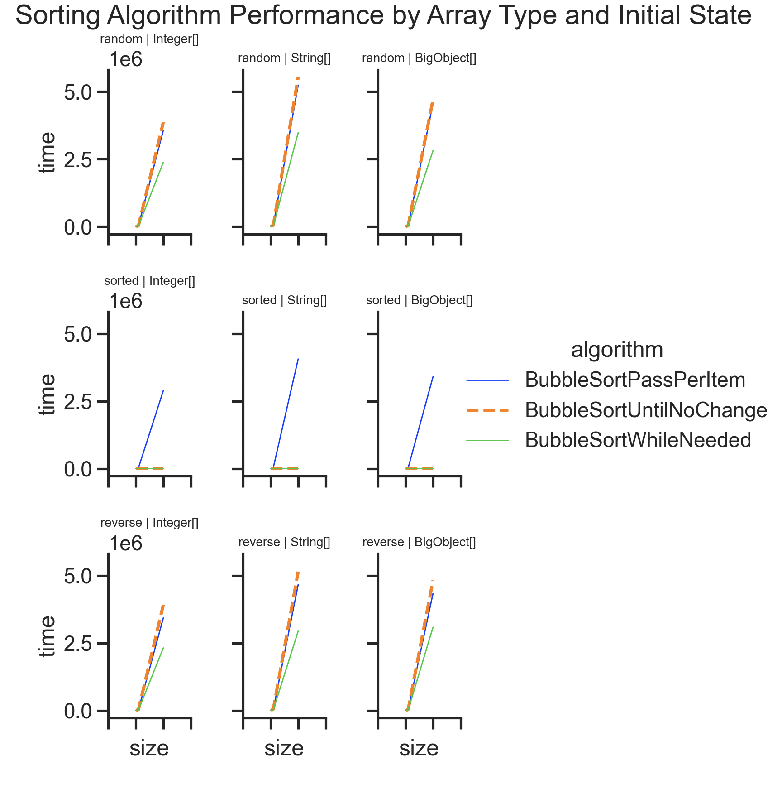
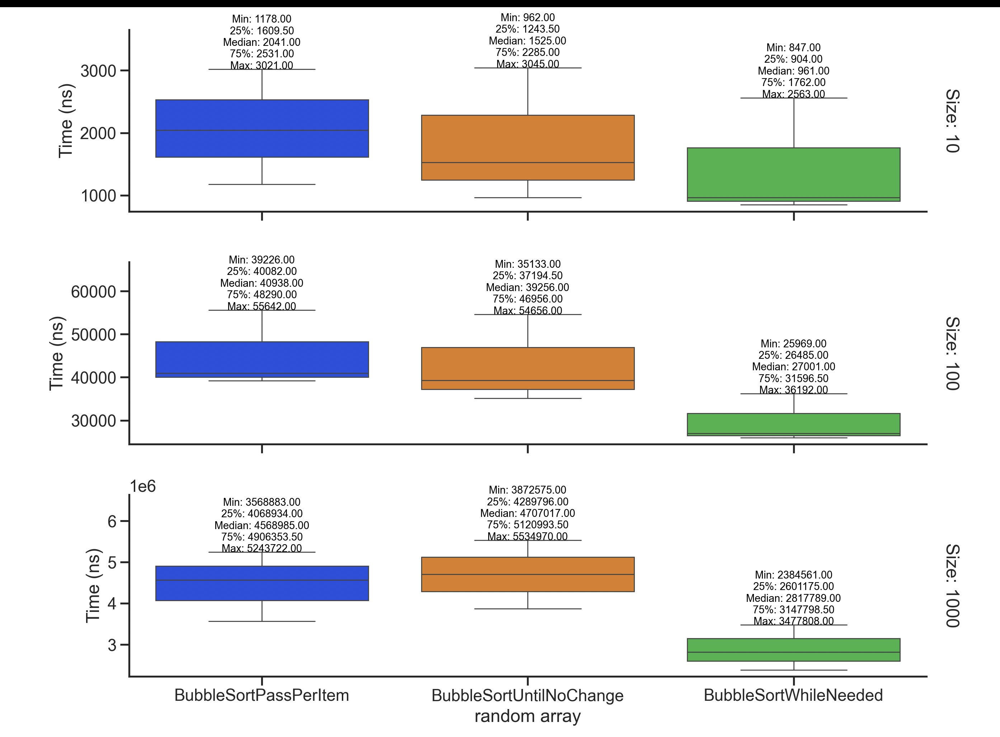
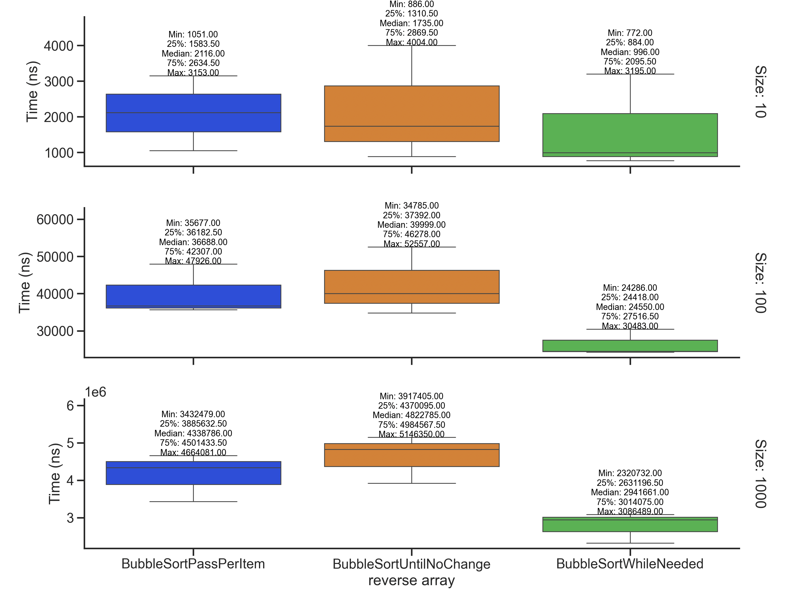
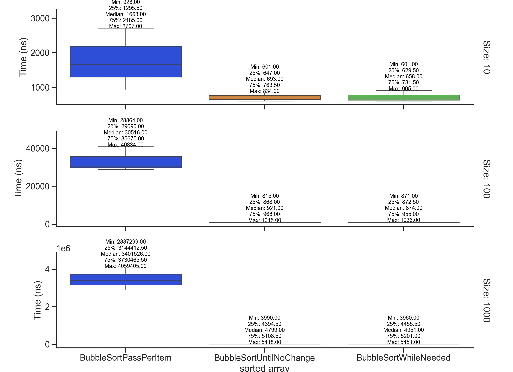

# Experimentation and Evaluation

## Assignment 1: The Bubble Algorithm Library

Analyze three sorting algorithms and decide which one is the most
suitable having as criterion only **performance**:
minimum execution time required.

Algorithms:

- _BubbleSortPassPerItem_
- _BubbleSortUntilNoChange_
- _BubbleSortWhileNeeded_

Implementing all the _Sorter_ interface.

### Report

The [assignment 1 report](https://docs.google.com/document/d/1XvRoceLrXU1l0qW0ANj-XlElyYg7VFREm2lR_bghKqo/edit?usp=sharing)
is publicly available in Google Docs.

### Replicate experiment

Clone the repository.

Satisfy the [requisites](#requisites) dependencies.

Run the project with _gradlew_ file in root of repository:

```shell
./gradlew :app:run
```

### Requisites

Installed [gradle 8.4](https://gradle.org/) and [openjdk 21](https://jdk.java.net/21/) via [sdkman](https://sdkman.io/) .

```shell
curl -s "https://get.sdkman.io" | bash
source "~/.sdkman/bin/sdkman-init.sh"
sdk install gradle 8.4
sdk install java 21-open
```

Test setup following JUnit 5 [docs](https://junit.org/junit5/docs/current/user-guide)
with [build.gradle](https://github.com/junit-team/junit5-samples/tree/r5.10.1/junit5-jupiter-starter-gradle)
template as a reference.

Multiple subprojects configured from [docs](https://docs.gradle.org/current/userguide/multi_project_builds.html)
following [template project](https://github.com/jghoman/gradle-subprojects).

Code style consistency enforced with checkstyle plugin following
Google Java Style Guide [docs](https://checkstyle.sourceforge.io/google_style.html).

## Plots

### Overal speed becnhmark



### Box plots for each statistic






